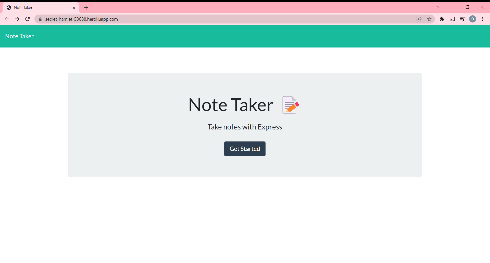
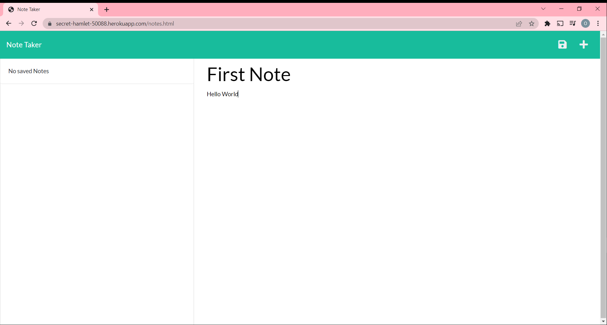
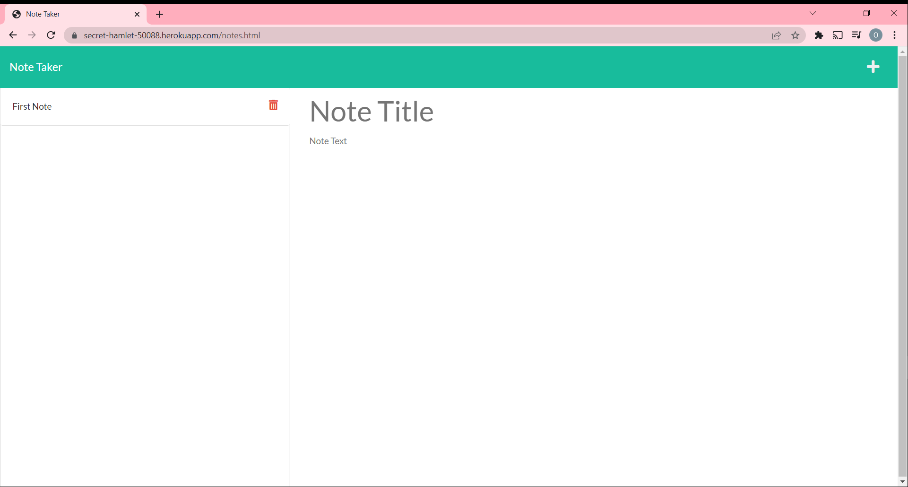
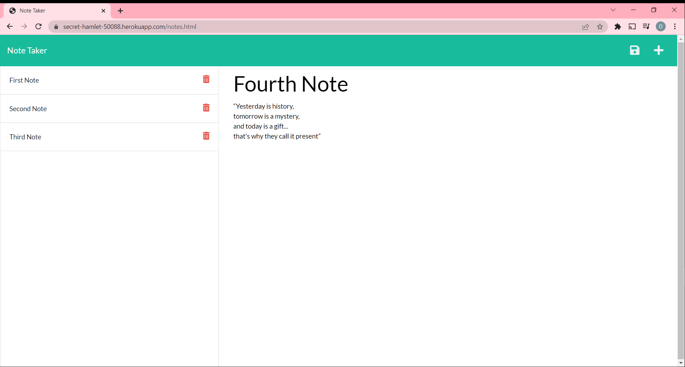
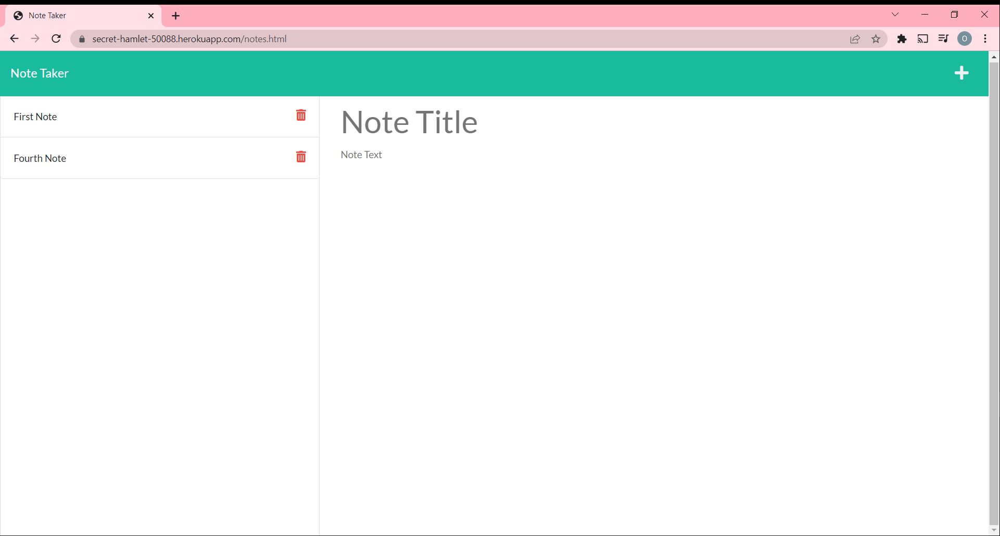

# Note Taker

## Description

This project consisted in building the back-end application of a Note Taker that could write, save and delete notes using an Express.js back-end and to save and retrieve notes data from a JSON file.

## User Story

```
AS A small business owner
I WANT to be able to write and save notes
SO THAT I can organize my thoughts and keep track of tasks I need to complete
```

## Acceptance Criteria

```
The application should:
```

- allow the users to create and save notes.
- allow the users to delete saved notes.
- allow the users to view their saved notes.

## Application Use/ Mock-Up

The following images show the the use of the application

When the application is deployed this will be the first page the user will see.


When the "Get Started" link is cliked then the user is presented with a page to take notes.


When the user clicks on the empty placeholder then he can insert text.


When the user clicks on the saved icon button on the top right of the page then his note is saved in the left column.


The user can save many notes.


When the user clicks on the red trash icon button then the note will be deleted.


## Deployed Link

You can find my [**heroku Link**](https://secret-hamlet-50088.herokuapp.com/) by clicking on it.

## Author

[Olivier R.Measson](https://github.com/Zeitouna)

## Acknowledgments

- My teacher [Swapnil Gaikwad](https://github.com/SwapnilGaikwad) for all the help and patience he offered during the ESMT Full Stack Development bootcamp.
